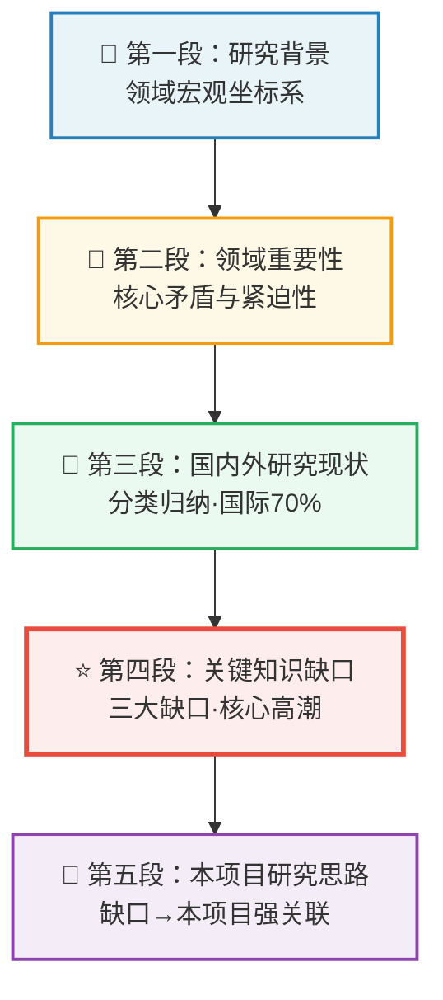
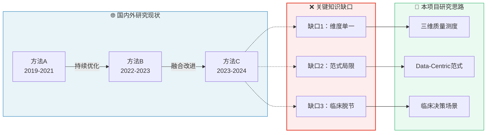
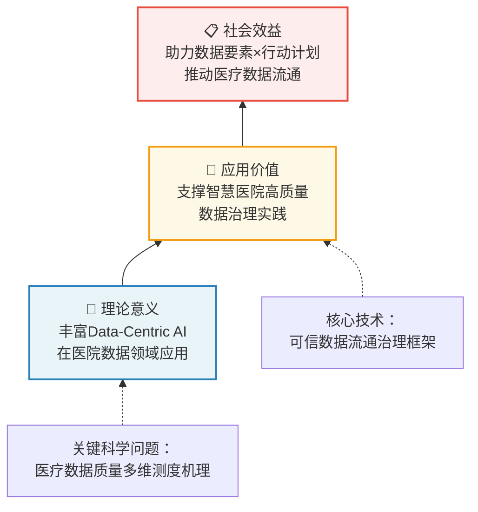

# NSFC Rationale Writer — 国自然理论依据专项写作技能

## 核心定位

**理论依据**（立项依据）是国自然申请书中最重要、最难写、最体现功力的部分。评审专家平均只用约20分钟审阅整份申请书，而**理论依据是必读部分**——它是回答"Why"（为什么要做）的核心章节。

> 本技能专门解决理论依据"不会写、写不深、写不精"的问题，提供可直接套用的黄金模板和流程化写作方法。

---

## 一、理论依据的评审标准

### 评审专家在看什么

| 维度 | 权重 | 核心问题 |
|------|------|---------|
| 科学意义 | 30% | 研究的问题是否重要？是否值得国家资助？ |
| 前沿性 | 25% | 是否站在国际/国内前沿？与最新进展差距在哪？ |
| 创新性铺垫 | 25% | 是否为申请书后续创新点做好逻辑铺垫？ |
| 逻辑严谨性 | 20% | 国内外现状是否系统梳理？问题归纳是否到位？ |

### 三档评分特征

| 评分档 | 理论依据特征 |
|--------|------------|
| **A档（优先资助）** | 国际前沿定位精准，问题归纳深刻，逻辑层层递进，图文并茂，有独特学术视角 |
| **B档（可资助）** | 研究意义清晰，国内外现状较完整，逻辑基本通顺，但缺乏深度和独特视角 |
| **C档（不资助）** | 研究意义模糊，文献综述零散，问题归纳浅显，逻辑混乱或跑题 |

---

## 二、标准结构：黄金五段式

理论依据的标准结构是**由大到小、由面到点、层层递进**：

```
第一段：研究背景（宏观面）
    ↓ 第二段：领域重要性（为什么紧迫）
    ↓ 第三段：国内外研究现状（别人做了什么）
    ↓ 第四段：关键知识缺口（别人没做什么/做错了什么） ← 核心段落
    ↓ 第五段：本项目研究思路（我来做/我的独特视角）
```

### 每段的核心要素

#### 第一段：研究背景

**功能**：建立研究领域的大坐标系，让评审专家快速定位你的工作。

**写作公式**：
> `[领域]` 是 `[国家战略/重大需求/行业痛点]` 的核心组成部分，近年来呈现 `[趋势描述]` 态势。

**示例**：
> 医疗数据作为国家基础性战略资源，是公立医院高质量发展的核心要素，也是"数据要素×"行动计划重点赋能领域[1]。随着智慧医院建设深入推进，三级公立医院年均产生PB级医疗数据，且以年均30%的速度增长[2]。

---

#### 第二段：领域重要性

**功能**：论证研究的紧迫性和必要性。

**写作公式**：
> 然而，当前面临 `[核心矛盾/瓶颈]` 问题，导致 `[直接后果]`，已成为制约 `[更高目标]` 的关键瓶颈。

**关键词**（高权重词）：
- 待解决、亟待突破、瓶颈问题、关键挑战、共性难题
- 迫切需要、迫在眉睫、刻不容缓
- 影响深远、事关重大、具有重要战略意义

**示例**：
> 然而，医疗数据要素化进程面临严峻挑战：数据质量参差不齐，标注一致性差，导致AI模型泛化性能受限[3]；数据孤岛现象突出，跨机构协作缺乏可信数据治理框架[4]；现有数据集构建方法重"以模型为中心"、轻"以数据为中心"，难以满足精细化医疗决策需求[5]。上述问题已成为制约智慧医院高质量发展的核心瓶颈。

---

#### 第三段：国内外研究现状

**功能**：系统展示你对领域的全面了解，避免"漏引重要文献"。

**组织原则**：
1. **分类归纳，而非逐篇罗列** — 按研究主题/技术路线分组
2. **国际为主（70%）+ 国内为辅（30%）** — 国际前沿引领
3. **引用权威期刊** — CNS、领域顶刊、近5年为主
4. **自己的前期工作有机融入** — 自然承接，不突兀

**分类方法**（常用三种）：
- 按**技术路线**分：方法A、方法B、方法C
- 按**研究对象**分：XX问题、YY问题、ZZ问题
- 按**时空维度**分：国外研究进展 → 国内研究进展 → 差距分析

**避坑指南**：
- ❌ 不要逐篇列出作者+年份（流水账）
- ❌ 不要遗漏近2-3年重要文献（显得不跟踪前沿）
- ❌ 不要只引用中文文献（外文比例需≥60%）

---

#### 第四段：关键知识缺口（★核心段落★）

**功能**：这是整个理论依据的"高潮" — 精准指出当前研究空白，为本项目提供立项依据。

**写作公式**：
> 综合上述分析可见，现有研究存在以下不足：
> 1. **缺口一**：`[具体问题]`，`[现有研究为何无法解决]`；
> 2. **缺口二**：`[具体问题]`，`[现有方法为何不适用]`；
> 3. **缺口三**：`[具体问题]`，`[本研究的机会窗口]`。

**常用句式**：
> "现有研究多关注……，但对……问题缺乏系统性研究"
> "虽已有……方法，但仍不清楚……机制"
> "目前国内外尚无针对……的系统性解决方案"
> "现有数据集构建多采用……范式，尚未见……研究"

**示例**：
> 综合上述分析，现有研究存在以下三方面不足：①**数据质量维度单一**：现有研究多从完整性、时效性等单一维度评价医疗数据质量，尚未形成覆盖技术、语义、治理三维度的综合测度体系；②**以模型为中心范式局限**：现有方法重在优化模型结构，对数据质量提升的贡献有限；③**缺乏临床适用性评估**：现有评价指标未充分考虑临床决策场景的特殊需求。

---

#### 第五段：本项目研究思路

**功能**：从问题缺口自然过渡到本项目的解决思路，建立"缺口→本项目"的强关联。

**写作公式**：
> 鉴于上述问题与挑战，本项目拟 `[研究视角/方法]`，`[具体研究内容]`，以期 `[预期目标]`。

**关键技巧**：
- 研究视角必须**与缺口一一对应**（缺口1→你的视角A，缺口2→视角B）
- 用"拟"或"将"开头，表明这是计划而非已做
- 与摘要形成呼应，但更详细展开研究逻辑

**示例**：
> 鉴于上述问题与挑战，本项目拟在Data-Centric AI视角下，以临床数据治理为核心场景，构建"质量测度→可信流通→决策优化"三位一体的公立医院高质量数据集构建框架，系统解决医疗数据质量评价维度单一、数据要素流通缺乏可信机制等关键问题。

---

## 三、Mermaid逻辑流程图

在理论依据中插入Mermaid图是**高加分项**（图文并茂），以下是标准模板：

### 3.1 五段式结构图



### 3.2 缺口对应关系图



### 3.3 研究意义递进图



---

## 四、写作流程：五步法

### 第一步：领域扫描（1-2天）

```
目标：建立领域的宏观知识图谱
任务：
1. 精读3-5篇最新Survey/综述论文（近2年）
2. 精读本领域NSFC资助项目的摘要（3-5项）
3. 整理出：领域主流方法 / 核心瓶颈 / 最新趋势
工具：Connected Papers、Semantic Scholar、Google Scholar
```

### 第二步：问题凝练（1天）

```
目标：从众多问题中凝练出1-2个关键科学问题
方法：
1. 列出10个问题
2. 追问"为什么"（5次迭代）
3. 识别"知识缺口"而非"技术缺口"
4. 确认：这个问题底层是科学问题，而非工程问题
输出：关键科学问题1-2条
```

### 第三步：文献综述撰写（2-3天）

```
目标：完成国内外研究现状（第三段）
原则：
1. 按主题分类，不按时间/作者排列
2. 每类不超过3-4篇，多则显得堆砌
3. 自己的前期工作用【本研究团队】标注，突出但不夸张
4. 缺口前用"然而"、"但"等转折词，自然引出第四段
输出：国内外研究现状初稿（2000字左右）
```

### 第四步：缺口论证（1-2天）

```
目标：精准撰写关键知识缺口（第四段）
技巧：
1. 缺口数量：2-3条，不宜过多
2. 每条格式：[现状] + [不足] + [本项目机会]
3. 缺口之间逻辑关系：并列 or 递进
4. 用具体文献支撑（避免空洞断言）
输出：关键知识缺口章节（800-1000字）
```

### 第五步：整体润色（1天）

```
检查清单：
□ 第一段是否3句话内让评审专家理解领域？
□ 第二段是否用数据/政策支撑紧迫性？
□ 第三段是否分类归纳？有无重要文献遗漏？
□ 第四段缺口是否精准？有无反驳余地？
□ 第五段是否与缺口一一对应？
□ 全文关键词是否统一（术语一致性）？
□ 外文引用比例是否≥60%？
□ 有无图文并茂（Mermaid/流程图）？
```

---

## 五、常见错误与修正

### 错误1：背景写成综述

**错误表现**：
> "近年来，许多学者对医疗数据质量问题进行了研究。Smith等[1]提出……，Jones等[2]提出……，Wang等[3]提出……。"

**问题**：逐篇罗列，缺乏分析，评审无法判断作者的理解深度。

**正确写法**：
> "现有医疗数据质量研究可分为三大类[1-4]：①基于完整性检测的方法[1]，主要关注……；②基于准确性验证的框架[2]，但存在……局限；③基于时效性评估的指标[3-4]，尚未考虑……问题。"

---

### 错误2：缺口写得太泛

**错误表现**：
> "现有研究对医疗数据质量问题关注不够，需要进一步深入研究。"

**问题**：任何研究都可以这样说，毫无信息量。

**正确写法**：
> "现有研究对医疗数据质量评价存在维度缺失：技术质量评价关注数据格式、完整性等表层特征[1-2]，语义质量评估聚焦概念一致性[3-4]，但缺乏融合临床适用性的多维综合测度框架。"

---

### 错误3：自己的前期工作喧宾夺主

**错误表现**：
> "本团队在前期工作中系统研究了医疗数据质量问题，建立了XX数据集，发表了XX篇论文，取得了XX成果。"

**问题**：理论依据是论证"为什么要做"，不是论证"你多厉害"。

**正确写法**：
> "本研究团队前期在医疗数据治理领域的研究表明[1-2]：【融入方式】……，为本次研究奠定了【具体什么】基础。"

---

### 错误4：外文引用比例不足

**错误表现**：
> 参考文献30条，其中25条中文，5条英文。外文比例仅16.7%。

**问题**：外文比例<60%会被评审认为对国际前沿了解不足。

**解决方案**：
1. 引用本领域顶会论文（NeurIPS/ICML/MICCAI/AMIA）
2. 用Survey论文间接引用更多外文文献
3. 删除低质量中文引用，换为同类高质量外文文献
4. 英文书籍章节、arXiv预印本也可计入外文

---

## 六、外文引文比例提升攻略

### 比例计算公式

```
外文比例 = 外文引文条数 ÷ 总引文条数 × 100%
```

### 快速提升技巧

| 技巧 | 操作方法 | 效果 |
|------|---------|------|
| 顶刊替换 | 中文普刊→同主题SCI论文 | +5-8% |
| Survey桥接 | 引用Survey时自然引用其参考文献 | +10-15% |
| 政策+学术双引用 | 政策文件+支撑它的学术文献 | +3-5% |
| 删除低质量中文 | 替换无法核实的中文引文 | +5-10% |

### 合格线参考

| 项目类型 | 外文比例合格线 |
|---------|-------------|
| 面上项目 | ≥60% |
| 青年基金 | ≥50% |
| 重点项目 | ≥70% |

---

## 七、图文并茂技巧

### 7.1 何时插图

| 位置 | 推荐图表类型 | 目的 |
|------|------------|------|
| 研究背景 | 趋势折线图 / 柱状图 | 数据支撑紧迫性 |
| 国内外现状 | 分类表格 / 方法对比图 | 清晰归纳 |
| 知识缺口 | 缺口示意图 | 可视化问题 |
| 研究思路 | 技术路线图 | 展示整体方案 |

### 7.2 图表制作规范

- **清晰度**：≥300 DPI，可放大不失真
- **中文字体**：中文期刊使用宋体/黑体，英文期刊使用Arial
- **配色**：简洁专业，避免过于鲜艳（红/绿/蓝为主色）
- **标注**：图注详细，让评审不看正文也能理解
- **推荐工具**：Python matplotlib、R ggplot2、Origin

---

## 八、引文管理规范

### 引文分布规则

```
理论依据章节（立项依据）：所有引文的100%
其他章节（二、三、四）：无引文段落
```

### 引文级别标注

```
【中科院一区】【中文核心】【SCI IF>10】【普通SCI】
【中文科技核心】【国际标准】【政策文件】【⚠️需核查】
```

### 引文真实性核查

**必查类型**：
1. DOI格式验证 → doi.org可解析？
2. 作者名+年份组合 → PubMed可查？
3. 期刊名+年份+卷期 → 与实际出版信息一致？
4. 中文核心期刊 → CNKI/万方可查？

**高风险引文特征**：
- 企业白皮书 / 咨询公司报告（非同行评审）
- 无法核实的DOI / 404链接
- 作者名为小写字母开头（多数造假论文特征）
- 发表年份与研究方向不符

---

## 九、与其他章节的逻辑关系

```
立项依据（Why — 为什么要做）
    ↓ 逻辑延伸
研究目标（What goal — 做成什么）
    ↓ 问题分解
研究内容（What to do — 做什么）
    ↓ 方法设计
研究方案（How — 怎么做）
    ↓ 能力证明
研究基础（Why you — 为什么是你做）
```

**关键原则**：立项依据中的每个"知识缺口"都必须在研究内容中有对应的研究专题。

---

## 十、实操检查清单（提交前必查）

### 格式检查
- [ ] 严格按照官方提纲标题（一级/二级标题一字不差）
- [ ] 正文页数 ≤30页（建议20页以内）
- [ ] 参考文献格式统一（作者姓名、期刊名、年份）
- [ ] 无错别字、无语法错误

### 内容检查
- [ ] 第一段3句话内建立领域坐标系
- [ ] 用数据/政策文件支撑紧迫性（第二段）
- [ ] 国内外现状分类归纳（非逐篇罗列）
- [ ] 知识缺口精准，无反驳余地
- [ ] 本项目思路与缺口一一对应
- [ ] 外文引文比例 ≥60%

### 逻辑检查
- [ ] 从第一段到第五段逻辑连贯，无断层
- [ ] 全文核心术语统一（首次全称+后续简称）
- [ ] 图文并茂（Mermaid/数据图/表格）
- [ ] 与摘要、研究内容、创新点无矛盾

### 引文检查
- [ ] 所有DOI可解析
- [ ] 所有期刊信息与实际一致
- [ ] 无企业白皮书/灰色文献
- [ ] 无虚构作者/论文

---

## 十一、参考资料

- NSFC官方指南（每年更新）：https://www.nsfc.gov.cn
- GB/T 7714-2015 参考文献著录规则
- 本技能配套：nsfc-write（申请书全文写作指南）
- 本技能配套：nsfc-policy（2026年度NSFC政策速查）
- 本技能配套：citation-auditor（引文真实性审核）
