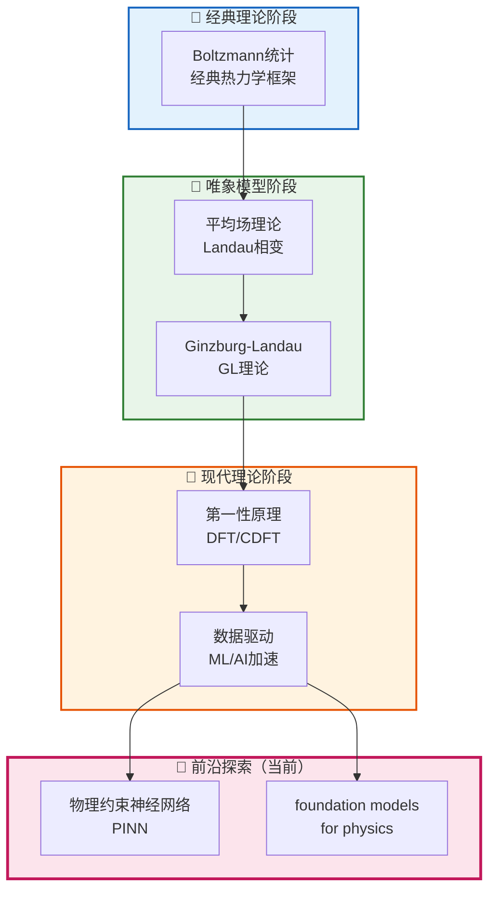
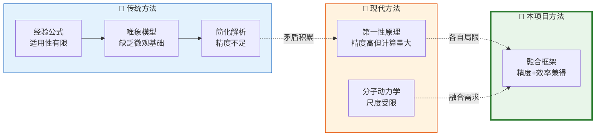
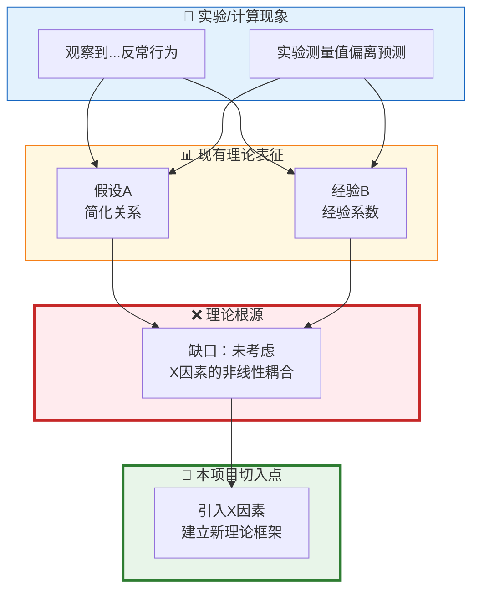
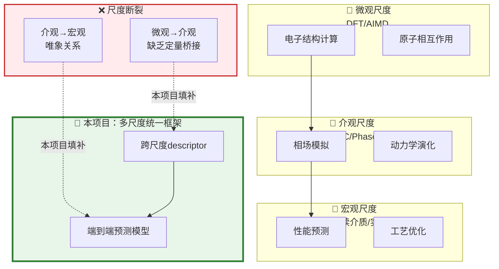

# NSFC Rationale Writer — 国自然立论依据专项写作技能（理工科版）

## 核心定位

> 理工科的立论依据与文理兼收的管理/医学方向**本质不同**：管理学科强调"问题导向-政策对齐"，理工科强调**"机理缺口-理论突破"**。本技能专为理工科设计，聚焦从"物理/化学/计算机理"出发的立论依据写作。

**立论依据**是国自然申请书中最核心的部分，评审专家通过它判断：
1. 你是否真正理解了领域的关键机理问题
2. 你的研究思路是否有真正的理论创新
3. 你的工作是否站在国际前沿

> 本技能提供可直接套用的**理工科立论依据黄金结构**和**机理缺口写作法**。

---

## 一、理工科 vs 文管类立论依据的核心差异

| 维度 | 理工科（数理/化学/信息/工程/材料） | 文管类（管理/医学/经济） |
|------|-----------------------------------|------------------------|
| **核心逻辑** | 机理缺口 → 理论突破 | 问题导向 → 政策对齐 |
| **论证重心** | "这个现象的深层机理是什么？" | "这个社会/行业问题如何解决？" |
| **缺口类型** | 理论空白、方法局限、模型不精确 | 政策缺位、标准缺失、实践困境 |
| **引用偏好** | 定理/公式/实验数据支撑 | 统计调查/政策文件/案例 |
| **创新表述** | 新机理、新理论框架、新模型预测 | 新框架、新模式、新政策建议 |
| **图示类型** | 技术演进时间线、机理示意图、模型对比 | 问题框架图、治理架构图、政策流程图 |

**理工科立论依据的本质**：用**已知的实验/计算事实** + **严密的逻辑推导**，证明当前理论/方法**无法解释某个现象或无法满足某个需求**，从而建立本项目的**立项必然性**。

---

## 二、理工科立论依据评审标准

### 评审专家四维评价

| 维度 | 权重 | 理工科核心问题 |
|------|------|--------------|
| **科学意义** | 30% | 研究的问题是否触及领域核心机理？是否具有普适性理论价值？ |
| **前沿性** | 25% | 是否追踪最新顶刊（Nature/Science/PRL/IEEE等）工作？与国际前沿差距？ |
| **创新逻辑** | 30% | 缺口推导是否严密？本项目的解决思路是否有理论依据？ |
| **完备性** | 15% | 国内外主要相关工作是否覆盖？有无重要遗漏？ |

### 三档评分特征

| 评分档 | 理工科立论依据特征 |
|--------|------------------|
| **A档（优先资助）** | 机理缺口推导严密，国际前沿定位精准，理论创新点明确，有定量证据支撑，图文并茂 |
| **B档（可资助）** | 科学意义清晰，文献覆盖较全，逻辑基本通顺，但机理分析深度不足或创新点模糊 |
| **C档（不资助）** | 研究意义模糊，文献综述碎片化，缺口推导缺乏逻辑连贯性，理论与方法混淆 |

---

## 三、理工科立论依据黄金结构：三层七段法

> 理工科的立论依据核心是**"机理推导"**——从现象出发，逐层追问深层机制，最终落到本项目的理论切入点。

```
第一层：现象与意义层（宏观立意）
    ├─ 第一段：研究背景与科学意义
    └─ 第二段：领域前沿动态与趋势

第二层：机理缺口层（核心论证）← 理工科的灵魂
    ├─ 第三段：国内外研究现状（分类归纳·技术演进）
    ├─ 第四段：现有方法的理论局限（机理缺口）
    └─ 第五段：本项目的理论切入点（与缺口的强关联）

第三层：研究框架层（收尾升华）
    └─ 第六段：本项目研究思路与理论预期
```

### 每段核心任务

#### 第一段：研究背景与科学意义

**功能**：建立研究领域的物理/化学/计算坐标系，点明研究的**普适性理论价值**。

**理工科写作公式**：
> `[核心现象/物理规律/化学机制/计算范式]` 是 `[领域基础问题]` 的核心，其 `[精确性/适用性/效率]` 直接制约 `[下游应用/理论发展]`。

**理工科关键词**（高权重词）：
- 揭示...规律/机理/本质
- 理解...行为/机制/相互作用
- 提升...精度/效率/可靠性
- 拓展...适用范围/理论边界
- 突破...瓶颈/极限/困境

**示例（材料科学）**：
> 高熵合金的相结构稳定性是制约其在极端环境下服役性能的核心基础问题[1]。相结构的多元耦合效应使得传统相图预测方法面临根本性挑战：Fe-Cr-Co-Ni-Mn体系的相变路径存在非线性耦合[2]，现有CALPHAD方法在计算高熵体系自由能时误差超过30%[3]，这一瓶颈已成为制约高熵合金材料设计理论发展的关键障碍。

**示例（信息科学/AI）**：
> 深度神经网络的可解释性是制约其在高风险场景落地应用的核心瓶颈[1]。现有解释方法多聚焦于特征相关性分析，但对其决策边界的几何特性缺乏理论刻画[2]；研究表明DNN的对抗脆弱性与输入空间曲率存在深刻关联[3]，但现有理论框架无法建立两者之间的定量映射关系。

---

#### 第二段：领域前沿动态与趋势

**功能**：展示你对国际前沿的追踪，引出研究切入的最佳时机。

**写作公式**：
> 近年来，`[国际顶级期刊/顶会]` 发表的一系列工作表明领域正在经历 `[范式转变/理论革新/技术突破]`，具体表现为：①`[趋势1]`；②`[趋势2]`；③`[趋势3]`。这些进展为 `[本研究]` 提供了 `[理论基础/技术条件/验证机会]`。

**理工科前沿动态来源**：
- Nature/Science/PRL (物理学)
- JACS/Angew Chem (化学)
- IEEE TPAMI/NeurIPS/ICML (AI/信息)
- Nature Materials/Advanced Materials (材料)
- 顶会最佳论文/综述论文 (近2年)

---

#### 第三段：国内外研究现状（技术演进视角）

**功能**：系统梳理领域发展脉络，重点展示技术演进中的**每一次范式跃迁**，而非逐篇罗列文献。

**组织原则**：
1. **按技术范式/理论框架分类**，而非按时间或作者排列
2. **每个类别不超过4篇**，突出代表性工作
3. **突出里程碑工作**：首次提出某理论/方法的工作
4. **国际前沿为主**（≥70%），国内为辅

**理工科分类维度**：
- 按**理论框架**分：经典理论 → 唯象模型 → 第一性原理/数据驱动
- 按**方法路线**分：方法A（优缺点）→ 方法B（优缺点）→ 方法C（最新进展）
- 按**研究尺度**分：微观（DFT/MD）→ 介观（相场/KMC）→ 宏观（连续介质）

**高阶技巧——技术演进树**：



---

#### 第四段：现有方法的理论局限——理工科核心段落（★）

**功能**：这是整个立论依据的**灵魂**——通过严密的机理分析，精准指出当前理论/方法的**根本性局限**，为后续研究提供立项依据。

**理工科缺口类型与写作方法**：

| 缺口类型 | 缺口描述 | 写作公式 |
|---------|---------|---------|
| **T1: 理论空白型** | 某物理现象/机制缺乏理论解释 | "现有理论无法解释...现象（Fig. X[文献]），其根本原因在于..." |
| **T2: 模型局限型** | 现有模型在特定条件下失效/精度不足 | "现有...模型[文献]在...条件下预测误差高达...%（定量证据），原因在于..." |
| **T3: 尺度断裂型** | 不同尺度理论之间缺乏桥梁 | "微观机理[DFT]与宏观现象[实验]之间缺乏定量桥梁，现有工作尚无法..." |
| **T4: 方法对立型** | 两种主流方法给出矛盾预测 | "方法A[文献]与方法B[文献]对...的预测存在根本矛盾，其实质在于..." |

**缺口写作核心公式**：
```
[定量证据] → [分析原因] → [锁定理论根源] → [推导本项目机会]
```

**逐句模板**：
> 针对现有模型的上述误差，已有研究者尝试改进[1-2]，但改进均停留在参数调整层面，**未能触及根本性理论局限**：现有方法基于 `[简化假设/经验关系/唯象描述]`，忽略了 `[关键物理因素/多尺度耦合/非线性效应]` 的主导作用。具体而言：
> - `[理论缺陷1]`：现有模型假设`[某种关系]`，但这一假设在`[某种条件]`下不成立（见[文献]Fig. X的实验数据）；
> - `[理论缺陷2]`：现有方法采用`[某种近似]`，导致在`[某个物理量]`的预测上存在系统性偏差（定量：偏差>30%[文献]）。

**定量证据支撑库（理工科常用）**：
- "实验测量值与理论预测偏差高达 X 倍"
- "现有模型在 XX 条件下的误差超过 Y%"
- "文献[1-3]均报道了...的矛盾现象"
- "理论上，[定理/原理]决定了这一现象的极限是..."

**示例（化学）**：
> 针对催化剂活性预测，现有机器学习模型面临根本性理论挑战[1-5]：①**数据分布偏移**：训练数据集中催化剂活性分布与测试集存在显著差异（KL散度>0.5[3]），导致外推性能急剧下降；②**缺乏物理解惑**：现有黑箱模型无法揭示活性与电子结构之间的物理机制[4]，使得模型难以指导新催化剂设计；③**尺度断裂**：原子尺度DFT计算与宏观反应速率之间缺乏有效的多尺度桥接方法[5]。这些局限性使得"AI加速催化剂发现"的愿景仍停留于试错筛选阶段。

---

#### 第五段：本项目的理论切入点

**功能**：精准对接第四段的理论缺口，展示本项目的**独特理论视角**和**创新切入点**。

**写作公式**：
> 鉴于上述理论与方法局限，本项目拟从`[独特理论视角]`，以`[具体物理/化学/计算对象]`为切入点，构建`[新理论框架/改进模型/统一理论]`，以期实现`[具体理论目标]`。

**关键技巧**：
- 切入点必须**直接回应第四段的每一个理论缺口**
- 用"**本项目提出**"、"**本研究拟**"等表述，明确这是创新点
- 避免空泛，要给出**具体的理论预期**

**反例**：
> "本项目将开展相关研究，建立新理论。"

**正确写法**：
> 本项目拟从**界面电子结构耦合**视角出发，基于第一性原理计算与机器学习融合方法，构建催化剂活性与表面电子descriptor之间的定量理论映射（理论目标：建立精度误差<10%的新活性预测模型，直接回应缺口T1-T3）。

---

#### 第六段：本项目研究思路与理论预期

**功能**：收束全文，勾勒研究的整体理论框架，与摘要形成呼应。

**写作公式**：
> 本项目拟通过`[核心研究方法]`，系统研究`[核心物理/化学/计算问题]`，预期将`[具体理论贡献]`，为`[领域发展/应用前景]`提供理论支撑。

---

## 四、理工科专用句库（高阶表达）

### 4.1 描述理论空白的句式

| 句式 | 适用场景 |
|------|---------|
| "现有理论框架尚无法建立...与...之间的定量关系" | 缺乏桥梁型缺口 |
| "...的根本机制至今尚不清楚，已成为制约...发展的理论瓶颈" | 机理未知型缺口 |
| "目前国内外关于...的理论研究仍属空白，缺乏系统性理论分析" | 空白型缺口 |
| "...的深层物理机理尚未被揭示，现有研究多停留在现象描述层面" | 深度不足型缺口 |

### 4.2 描述方法局限的句式

| 句式 | 适用场景 |
|------|---------|
| "现有...方法在...条件下存在根本性局限，其理论预测误差高达...%" | 定量误差型 |
| "基于...假设的经典方法在...体系中不再适用，原因在于..." | 假设失效型 |
| "...方法与...方法的预测结果存在本质矛盾，其实质在于..." | 矛盾对立型 |
| "现有方法的计算复杂度为O(N^...)，难以应用于实际体系（>10000原子）" | 计算瓶颈型 |

### 4.3 描述前沿趋势的句式

| 句式 | 适用场景 |
|------|---------|
| "近年来，`Nature/Science/PRL`发表的系列工作[1-3]表明，`...`已成为国际前沿热点" | 顶刊引领型 |
| "突破传统范式，...领域正在经历从`经验主导`向`理论驱动`的根本性转变" | 范式转变型 |
| "当前国际上的最新进展[文献]已初步验证了...的可行性，但其理论机理尚不清晰" | 最新进展型 |

### 4.4 描述本项目切入点的句式

| 句式 | 适用场景 |
|------|---------|
| "本项目首次提出...理论框架，系统建立...与...之间的定量关联" | 首创框架型 |
| "本研究从...这一独特视角出发，有望从根本上解决...难题" | 视角独特型 |
| "本项目拟发展...新方法/新模型，填补...理论空白，具有重要的科学价值" | 填补空白型 |

---

## 五、Mermaid技术演进图模板

理工科立论依据中插入**技术演进图**是强烈加分项：

### 5.1 方法演进对比图



### 5.2 机理缺口可视化图



### 5.3 多尺度耦合架构图



---

## 六、理工科立论依据写作流程

### 第一步：领域机理扫描（1-2天）

```
核心任务：建立领域的"物理/化学/计算知识图谱"

操作步骤：
1. 精读2-3篇最新顶刊Review/Survey（近2年，Nature/Science/Phys Rev/Chem Rev）
2. 绘制领域技术演进时间线：经典理论 → 唯象模型 → 现代方法
3. 标注每个范式跃迁的里程碑论文（<10篇）
4. 识别当前领域的"共识"与"争议"

输出：技术演进树 + 里程碑文献清单
```

### 第二步：机理缺口锁定（1天）

```
核心任务：从实验/计算事实中定位理论缺口

操作步骤：
1. 收集3-5个支持缺口的"定量证据"（误差数据/矛盾现象/失效案例）
2. 分类：T1-T4哪种缺口类型？
3. 追问：缺口的"根本原因"是什么？（物理/化学/数学根源）
4. 验证：这一缺口是否被其他文献独立发现？（交叉验证）

输出：缺口定位报告（300-500字）
```

### 第三步：文献综述撰写（2-3天）

```
核心任务：按技术范式分类梳理，国内外现状

操作步骤：
1. 将文献分成2-3个类别（每个类别3-4篇）
2. 每类标注：方法名称、核心假设、关键贡献、理论局限
3. 自然过渡到第四段缺口：使用"然而"、"但"、"尚不清楚"等转折词
4. 嵌入技术演进图（Mermaid）

输出：立论依据第三段初稿（1500-2000字）+ Mermaid图
```

### 第四步：缺口论证与理论切入（1-2天）

```
核心任务：完成理工科核心段落（第四段+第五段）

操作步骤：
1. 第四段：按"定量证据→原因分析→理论根源"三步走
2. 每个理论缺口对应1-2篇文献作为证据
3. 第五段：精准对接每个缺口，给出本项目的理论切入点
4. 检查：缺口之间是否逻辑并列或递进？

输出：立论依据核心段落（1500-2000字）
```

### 第五步：整体润色与自查（1天）

```
检查清单（理工科立论依据专项）：
□ 第一段：是否3句话内让评审理解领域的重要性？
□ 第二段：是否引用最新顶刊/顶会工作（近2年）？
□ 第三段：是否按技术范式/理论框架分类？有无重要遗漏？
□ 第四段：每个缺口是否有定量证据支撑？
□ 第四段：是否锁定了理论根源（非表面现象）？
□ 第五段：切入点是否与每个缺口一一对应？
□ 全文：核心术语是否统一？首次全称+后续简称？
□ 外文引文比例是否≥60%？
□ 是否有Mermaid技术演进图/机理缺口图？
□ 与摘要的创新点是否一致？有无矛盾？
```

---

## 七、理工科常见错误与修正

### 错误1：把立论依据写成实验报告

**错误表现**：
> "近年来，国内外学者对XXX材料进行了大量研究。Zhang等[1]用XX方法制备了XXX，Li等[2]研究了XX性质，Wang等[3]测试了XX性能。"

**问题**：逐篇罗列，缺乏理论分析，评审看不出你对领域的深层理解。

**正确写法**：
> "高熵合金的相结构预测是材料基因组计划的核心科学问题[1-2]。现有计算方法可分为三类[3-6]：①基于CALPHAD的热力学方法，计算效率高但精度受限（误差>15%[3]）；②基于DFT的电子结构方法，精度高但仅适用于有限组分区[4]；③经验公式方法[5-6]，适用性有限。上述方法均未建立**成分-电子结构-相稳定性**的定量理论关联。"

---

### 错误2：缺口写得太泛（工程问题≠理论缺口）

**错误表现**：
> "现有研究对XXX问题关注不够，需要进一步深入研究。"

**问题**：任何工程应用都可以这样说，不是理论缺口。

**正确写法**：
> "现有理论框架无法解释高熵合金中的**鸡尾酒效应**的深层机制：尽管实验观测到[现象描述，Fig. X[7]]，但现有混合焓模型[3]和正则溶液模型[4]均无法定量预测这种非加和性效应，其根本原因在于**多组元相互作用的长程关联**尚未被现有理论框架所描述。"

---

### 错误3：理论与方法混淆

**错误表现**：
> "本项目的创新点在于采用深度学习方法预测XXX性能。"

**问题**：这是方法创新，不是理论创新。理工科立论依据需要论证**理论层面的创新**。

**正确写法**：
> "本项目提出**基于物理约束的深度学习理论框架**：将密度泛函理论（DFT）计算所揭示的电子结构演化规律作为物理先验约束嵌入神经网络结构，从根本上解决纯数据驱动模型的"黑箱"困境，建立可解释的"成分-电子结构-性能"定量理论映射。"

---

### 错误4：缺乏定量证据

**错误表现**：
> "现有方法存在较大误差，难以满足实际需求。"

**问题**："较大"是主观描述，需要定量支撑。

**正确写法**：
> "现有Kohn-Sham DFT方法在预测高熵合金晶格常数时，平均绝对误差（MAE）高达5.2 pm（实验基准[7]），这一误差已超过实验测量不确定度（<0.5 pm）一个数量级，根本原因在于GGA泛函对多组元体系的电子关联处理存在系统性偏差。"

---

## 八、外文引文比例与质量

### 理工科合格线

| 项目类型 | 外文比例合格线 | 推荐期刊级别 |
|---------|-------------|-----------|
| 面上项目 | ≥60% | Nature/Science/PRL/IEEE trans/中科院一区≥50% |
| 青年基金 | ≥50% | 领域顶刊≥40% |
| 重点项目 | ≥70% | Nature/Science/PRL≥50% |

### 理工科引文质量评估

```
高质量引文：
✅ Nature/Science/PRL/JACS/Angew Chem/IEEE Trans系列
✅ 领域顶会NeurIPS/ICML/CVPR/ICRA等
✅ 高被引论文（被引>100次）

中等质量引文：
⚠️ 普通SCI期刊（非一区）
⚠️ 国内核心期刊（仅作为国内现状补充）

低质量/风险引文：
❌ 企业白皮书、技术报告（非同行评审）
❌ 无法核实的DOI
❌ arXiv预印本（辅助引用，不超过10%）
```

---

## 九、理工科立论依据的自检量表

### 格式规范
- [ ] 严格按照官方提纲标题（一级/二级标题一字不差）
- [ ] 正文≤30页（A4，参考NSFC 2026标准）
- [ ] 参考文献格式统一（作者姓名、期刊名、年份、卷、页）
- [ ] 无错别字、无语法错误、无中英文标点混用

### 科学意义（第一段）
- [ ] 3句话内建立领域的物理/化学/计算坐标系
- [ ] 点明了研究的普适性理论价值（而非仅应用价值）
- [ ] 有顶刊文献[1-2]作为领域重要性的证据支撑

### 前沿动态（第二段）
- [ ] 引用最新顶刊/顶会工作（近2年）
- [ ] 展示了领域的范式转变/技术突破趋势
- [ ] 引出了研究切入的最佳时机

### 国内外现状（第三段）
- [ ] 按技术范式/理论框架分类（非逐篇罗列）
- [ ] 每类突出里程碑工作和核心假设
- [ ] 国际引文≥70%
- [ ] 嵌入技术演进Mermaid图

### 理论缺口（第四段 ★核心★）
- [ ] 缺口类型清晰（T1/T2/T3/T4）
- [ ] 每个缺口有定量证据（误差数据/矛盾现象）
- [ ] 锁定了理论根源（物理/化学/数学层面）
- [ ] 缺口之间逻辑并列或递进，无自相矛盾

### 理论切入点（第五段）
- [ ] 与第四段的每个缺口一一对应
- [ ] 给出了具体的理论框架/模型名称
- [ ] 阐述了预期理论贡献

### 图文并茂
- [ ] 有技术演进图（Mermaid或高质量数据图）
- [ ] 有机理缺口可视化图
- [ ] 图表清晰度≥300 DPI

### 引文质量
- [ ] 外文比例≥60%
- [ ] 无企业白皮书/灰色文献
- [ ] 所有DOI可解析
- [ ] 无虚构作者/论文

### 逻辑一致性
- [ ] 全文核心术语统一
- [ ] 与摘要的创新点完全一致
- [ ] 与研究内容的研究重点对应

---

## 十、配套技能

- [nsfc-write](https://github.com/copyleftz/nsfc-write) — 申请书全文写作指南
- [nsfc-policy](https://github.com/copyleftz/nsfc-policy) — NSFC政策速查
- [citation-auditor](https://github.com/copyleftz/citation-auditor) — 引文真实性审核
- NSFC官方指南：https://www.nsfc.gov.cn
